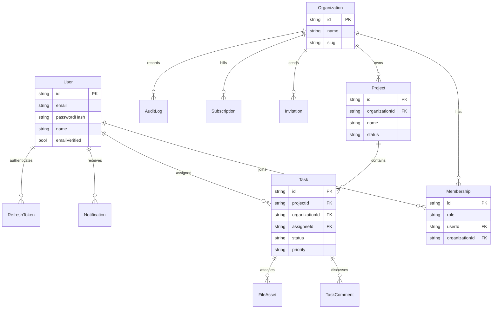

# ERD

```mermaid
erDiagram
  User ||--o{ Membership : joins
  Organization ||--o{ Membership : has
  Organization ||--o{ Project : owns
  Organization ||--o{ Invitation : sends
  Organization ||--o{ Subscription : bills
  Organization ||--o{ AuditLog : records
  Project ||--o{ Task : contains
  Task ||--o{ TaskComment : discusses
  Task ||--o{ FileAsset : attaches
  User ||--o{ Task : assigned
  User ||--o{ Notification : receives
  User ||--o{ RefreshToken : authenticates
  User {
    string id PK
    string email
    string passwordHash
    string name
    bool emailVerified
  }
  Organization {
    string id PK
    string name
    string slug
  }
  Membership {
    string id PK
    string role
    string userId FK
    string organizationId FK
  }
  Project {
    string id PK
    string organizationId FK
    string name
    string status
  }
  Task {
    string id PK
    string projectId FK
    string organizationId FK
    string assigneeId FK
    string status
    string priority
  }
```
